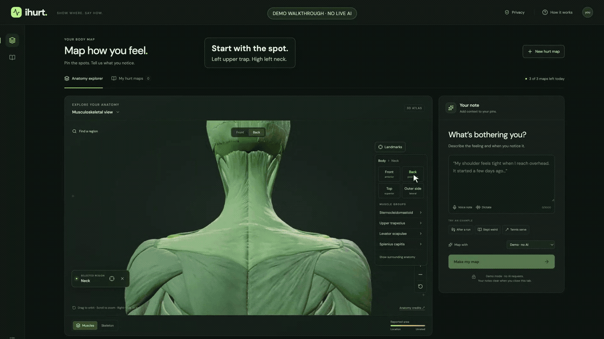

# iHurt

Sit like a shrimp all day? Wake up sore from apparently nothing? Unsure where to start reading about stretches and movement?

iHurt helps you describe discomfort when words alone are hard to get right. Place pins on a 3D body, add what you notice during rest or activity, and keep an offline pain journal. Export a **hurt map** to print, share, or bring to an AI chat.

**A stiff neck after sleep and tennis.** This recorded example maps the left upper trap and high neck, including discomfort when looking down or turning left. [Watch the full walkthrough](docs/media/neck-tennis-case-study.mp4).

*Recorded in demo mode; no live AI response. Anatomy by Z-Anatomy and BodyParts3D — [credits and licenses](public/models/ATTRIBUTION.md).*

## Keep a visual journal

- Place pins or drag to highlight an area, with up to ten marks per entry. Undo mistakes and add a comment to each spot.
- Start with **Quick tour**, switch between light and dark, and open **More tools** when you need muscle layers.
- Keep multiple entries, edit them later, and choose any sport or activity.
- Explore reading from your selected sources.
- Print the current 3D view or share an [.ihm map](docs/IHM.md) or JSON with notes, coordinates, and anatomy references.

**[Open the browser notebook →](https://ihurt.app/try/)** · [Install locally](docs/SETUP.md) · [Optional AI tools](docs/PROVIDERS.md)

Entries stay in this browser on this device. Export a backup before clearing browser data or switching devices. After the first complete load, the notebook works offline. AI sharing is optional. [Privacy and limitations](docs/SAFETY.md).

[Example report (PDF)](docs/examples/neck-tennis.pdf) · [Example journal (JSON)](docs/examples/neck-tennis.json)

[Fictional walkthroughs: desk work, running, and gaming](docs/media/README.md#fictional-notebook-examples)

**Hurt less. Feel better.**

## Not medical advice

**iHurt is not medical advice whatsoever. It does not diagnose, treat, cure, mitigate, or prevent any disease, injury, or condition.** It is an experimental educational journal. Maps and reading links do not establish a cause or a personal treatment plan. Do not delay professional care based on its output. [Read the full limitations](docs/SAFETY.md).

Pins describe locations on a shared reference model. They do not measure your body or identify the source of pain. [Mapping limitations](docs/GUIDE.md#mapping-a-location).

## About the project

React, TypeScript, Three.js, and WebAssembly, with an optional Python backend for AI tools.

[Usage and source curation](docs/GUIDE.md) · [Development and tests](docs/DEVELOPMENT.md) · [MIT code license](LICENSE)
