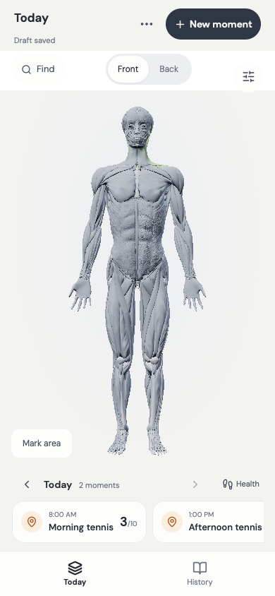
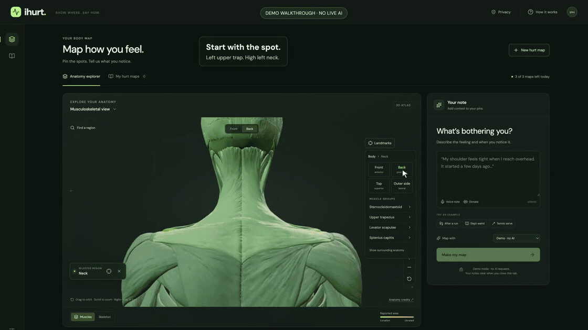

# iHurt

A visual notebook for how your body feels. Pin a spot on a 3D body, record what you notice, and keep the context for later. Look back through your entries or share a map when words alone are hard to get right.

**[Open the browser notebook →](https://ihurt.app/try/)** · [Run locally](docs/SETUP.md) · [iPhone and iPad setup](docs/IOS.md)

**Coming soon to the App Store for iPhone and iPad.** The native app is in development. The browser notebook is available now; there is no public App Store download yet.

## In the browser

- **Mark the spot.** Place pins, add a comment to each one, or highlight a wider area. Explore muscle and bone layers when several structures overlap.
- **Keep the context.** Record intensity, activity, timing, and your own words. Save multiple entries and return to edit them.
- **Keep a copy.** Export an [.ihm map](docs/IHM.md), JSON, a body-view image, or a report. Print from the browser to save a PDF.
- **Read or share when you choose.** Explore sources or bring an exported map to an AI chat. Journaling works without an AI account.

The notebook works offline after its first complete load. Notes and drafts stay in this browser on this device. Export a backup before clearing browser data or switching devices.

## Coming to iPhone and iPad

The development build brings the notebook closer to the moments you want to remember:

- **Today and History.** See a day’s pins together, with a timeline of moments. Add a quick entry, switch days, and search earlier notes and activities.
- **Quick pin editing.** Adjust intensity with a dial, add a nearby note, compare overlapping anatomy surfaces, and undo a removed pin.
- **On-device dictation.** Speak a note, review the words, then add them to your entry. Typing is always available; Apple speech support depends on the device and language.
- **Movement recording.** Use either camera to record a short, silent exercise clip. Review estimated body and hand positions, choose a moment, then mark where you felt discomfort. Pose estimates do not detect pain or place pins for you.
- **Optional Apple Health context.** Display workouts and daily steps beside your day’s notes. Access is read-only; Health results stay outside journal exports and AI sharing.

*Development preview using example entries. Anatomy by Z-Anatomy and BodyParts3D — [credits and licenses](public/models/ATTRIBUTION.md).*

The native target supports iOS and iPadOS 16.4 or later. Movement recording requires 18 or later; Health availability is checked on the device. Builds can be installed through Xcode while distribution is being prepared. [Setup and signing](docs/IOS.md) · [Recorded testing and remaining device checks](docs/IOS-VALIDATION.md).

## Try an example

**A stiff neck after sleep and tennis.** This earlier browser walkthrough maps the left upper trap and high neck, including discomfort when looking down or turning left. [Watch the walkthrough](docs/media/neck-tennis-case-study.mp4).

*Recorded in demo mode; no live AI response. The current interface differs. Anatomy credits and licenses apply to both previews.*

[Example report (PDF)](docs/examples/neck-tennis.pdf) · [Example journal (JSON)](docs/examples/neck-tennis.json) · [Fictional desk, running, and gaming examples](docs/media/README.md#fictional-notebook-examples)

## Privacy and limits

Sharing is deliberate. Native dictation and movement analysis run on the device. The iPhone/iPad app does not connect to the local AI server. Optional hosted research in the browser sends the topics and description you review before submitting. [Privacy and limitations](docs/SAFETY.md).

**iHurt is not medical advice whatsoever. It does not diagnose, treat, cure, mitigate, or prevent any disease, injury, or condition.** It is an experimental educational journal. Maps and reading links do not establish a cause or a personal treatment plan. Do not delay professional care based on its output.

Pins describe locations on a shared reference model. They do not measure your body or identify the source of pain. [Mapping limitations](docs/GUIDE.md#mapping-a-location).

## Build and contribute

React, TypeScript, Three.js/WebGL, and WebAssembly provide the shared notebook. The iPhone/iPad app uses Capacitor with Swift services for camera capture, Apple Vision, speech, and HealthKit. Optional local AI tools use a Python backend.

[Development and tests](docs/DEVELOPMENT.md) · [iOS/iPadOS quality record](docs/IOS-VALIDATION.md) · [Usage and sources](docs/GUIDE.md) · [Optional AI tools](docs/PROVIDERS.md) · [Voice setup](docs/VOICE.md) · [MCP integration](docs/MCP.md) · [MIT code license](LICENSE)

The code license does not replace the bundled anatomy and third-party asset licenses.

Built by Michael Sandborn · [Momnt](https://momnt.dev/?utm_source=github&utm_medium=referral&utm_content=ihurt)
