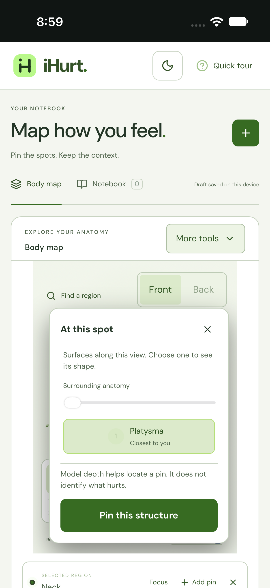
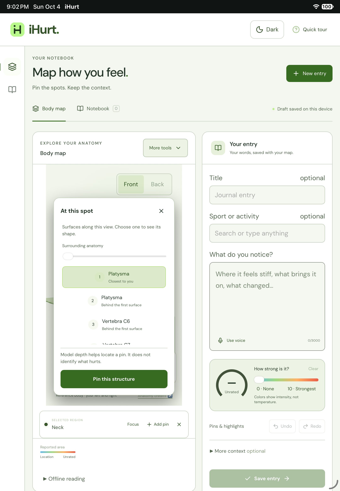

# Mobile notebook usability

Follow-up to the interaction findings in
[the simulator profiling PR](https://github.com/sandbornm/ihurt/pull/15).
Work started from `main` at `5512ed3`; the profiling PR remains separate.

## Changes

- Text inputs, textareas, and selects use at least 16px text on touch devices
  and narrow screens. This overrides the smaller responsive note/search styles.
  The viewport still permits user zoom.
- The region search keyboard offers Done. Enter dismisses the keyboard without
  choosing a region or adding a pin; the user still selects the result. Enter
  while composing text does not dismiss the field.
- The layer picker scrolls its choices and preview controls separately from its
  heading, explanation, and pin button. Pin confirmation stays visible when
  changing surfaces or spreading layers. The selected-surface medical limitation
  and saved-coordinate explanation keep their original wording.
- A surface changes only when clicked or selected with the keyboard. Moving the
  pointer across another row no longer replaces the selection on the way to Pin.
  The browser check verifies that the saved pin names the explicitly chosen surface.
- A 32px margin beside the anatomy stage gives touch users room to scroll the
  page. A narrower 16px margin proved insufficient in Chromium: a touch 8px from
  the canvas was redirected to the canvas and rotated the body. The regression
  check swipes through the middle of the wider margin, verifies page movement,
  and compares the canvas image to confirm that the body did not rotate.

The anatomy coordinates, journal format, persistence, API behavior, and native
permissions are unchanged. These changes apply to the web and packaged iOS app.
They address interaction problems; they do not establish a reduction in renderer
memory, battery use, or launch time. Physical-device memory profiling remains open.

## Verification

Run `npm run check`, `npm run test:ios-web`, `npm run test:controls`, and
`npm run test:browser`. The iOS bridge browser check now includes touch scrolling,
field sizing, search dismissal, explicit region selection, and reachable pin
confirmation before and after scrolling/spreading the layer list. It runs at
iPhone 16 Pro and iPad sizes, then continues its existing offline, persistence,
export, and failure checks. These browser checks use Chromium with mocked native
bridges; they do not emulate the iOS software keyboard.

After `npm run ios:sync`, run `npm run test:ios-native` and
`npm run test:ios-native -- --device 'iPad (A16)'`. The native scenario now types
a region search, dismisses the software keyboard with Done, explicitly selects
Neck, pins the surface without scrolling the picker, and verifies the notebook
after relaunch. It also checks that the focused note's WebView fits the device
width. Screenshots of pin confirmation and landscape information are attached
to each result bundle.

Native typing enters the public fixture sentence in two phrases and waits for
the exact text after each phrase before persistence checks. A single long
synthetic typing burst left a truncated prefix visible on one hosted iPhone run;
per-word typing exposed repeated 60-second waits for missing keyboard-animation
notifications on iOS 27. The phrase boundaries let WebKit consume pending input
without a separate typing operation for every word. The test never fills in
missing characters or accepts partial text.

## Results — 2026-10-04

Local checks used a Mac mini with Apple M4, Xcode 27.0 (27A266a), and the iOS
27.0 simulator runtime (24A434). Both native checks used fresh disposable
simulators and the final synchronized web assets.

| Check | Result |
| --- | --- |
| `npm run check` | Build, 101 TypeScript tests, and 32 Python tests passed. |
| `npm run test:ios-web` | iPhone 16 Pro and iPad (gen 7) Chromium contexts passed, including the new touch checks. |
| Linux browser parity | The complete `test:ios-web` scenario also passed in `mcr.microsoft.com/playwright:v1.63.0-noble`, using copied public build assets and test fixtures. |
| `npm run test:controls` | Desktop (1440px) and phone (390px) controls, drawing, undo, and camera cleanup passed. |
| `npm run test:browser` | Desktop (1440px) and phone (390px) journaling, exports, refresh, and offline checks passed. |
| `npm run test:ios-native` | iPhone 16 Pro native interaction scenario passed. |
| `npm run test:ios-native -- --device 'iPad (A16)'` | iPad A16 native interaction scenario passed. |

An earlier browser run timed out clicking Muscle list while other heavy checks
were running. A serial rerun passed both sizes without changes to that scenario
or its timeout; the cause of that timeout was not established. The initial iPad
native run reached the test timeout during per-word input. An intermediate
full-sentence typing call passed locally but later exposed the truncated-prefix
failure on a hosted iPhone. The final scenario uses the verified phrases
described above.
These are test outcomes, not application latency measurements.

The first hosted browser run exposed a platform difference in the new swipe
test: Chromium's synthesized touch-scroll command moved the page on macOS but
did not on Linux. The same failure reproduced in the official Playwright Linux
container. The check now sends a touch-start, a sequence of touch-move events,
and touch-end, retaining the page movement, unchanged canvas, and zero-pin
assertions. It does not scroll the page programmatically to satisfy the check.

Reviewed native screenshots show the pin button and medical limitation visible
before scrolling the layer list. The phone shows one choice above the footer;
the iPad has room for several. Browser screenshots also cover a scrolled list
with layer separation enabled; the pin action remains unobstructed.

The complete local `.xcresult` bundles and browser captures remain in ignored
`output/ios-native/` and `output/ios-check/`. The existing GitHub Actions workflows
run these checks on pull requests; hosted iOS checks use Xcode 26.3.

All input is synthetic or from the authorized public fixture. No provider calls,
signing changes, TestFlight uploads, or private notebook data are involved.
